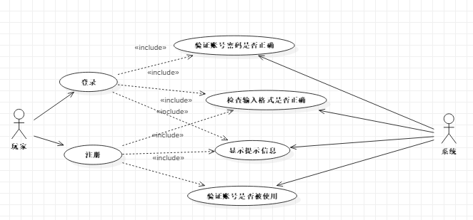
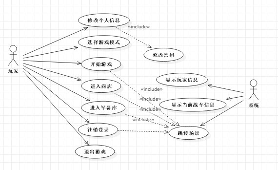
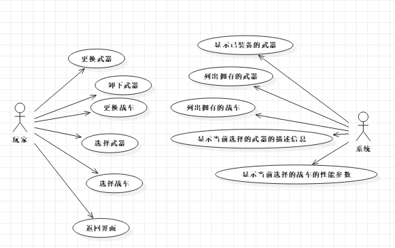
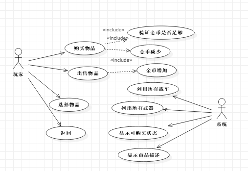
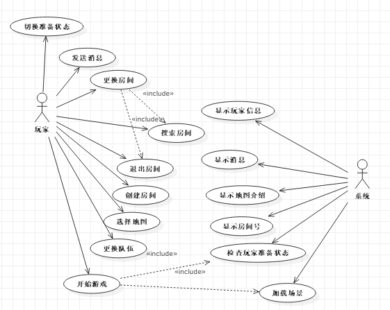
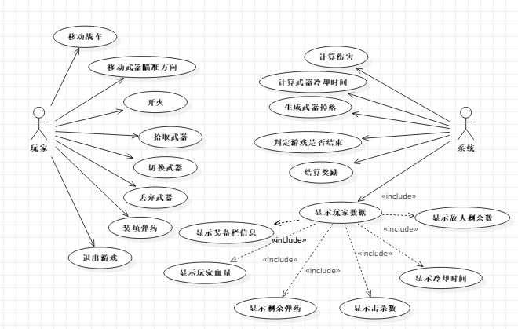
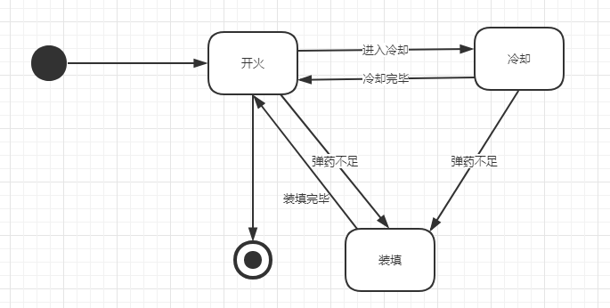
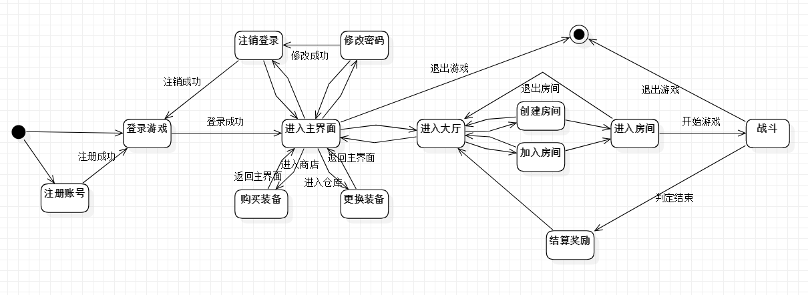
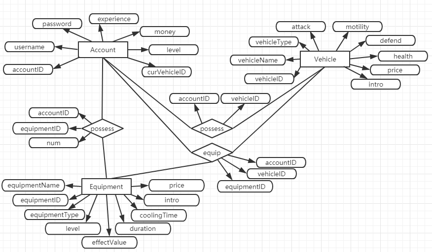
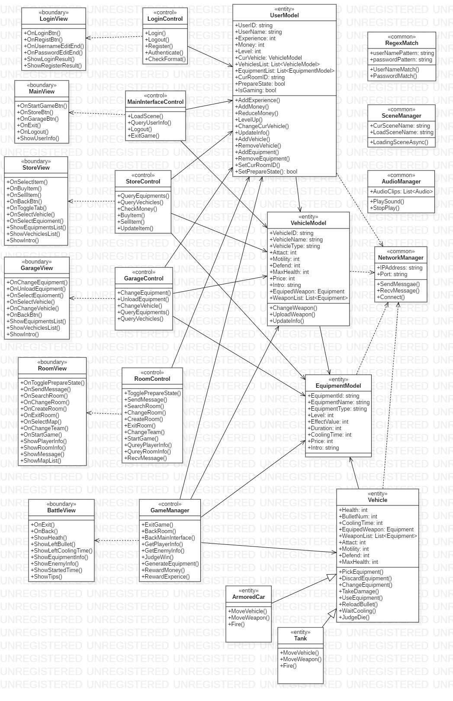

### VehicleBattle

#### 基于 PureMVC 框架的 Unity3D 网络对战 2D 射击游戏客户端

main code: [Assets/Scripts](Assets/Scripts)
 
server-side: [https://github.com/HWliiu/VehicleBattleServer](https://github.com/HWliiu/VehicleBattleServer)

 

#### 需求分析

    
     
    
总体用例图

 

    
     
    
登录注册模块用例图

 

    
     
    
主界面模块用例图

 

    
     
    
仓库模块用例图

 

    
     
    
商店模块用例图

 

    
     
    
房间模块用例图

 

    
     
    
战斗模块用例图

 
 

    
     
    
功能结构图

 

#### 界面设计

    
     
    
登录界面图

 

    
     
    
注册界面图

 

    
     
    
主界面图

 

    
     
    
个人信息界面图

 

    
     
    
修改密码界面图

 

    
     
    
商店界面图

 

    
     
    
仓库界面图

 

    
     
    
设置界面图

 

    
     
    
大厅界面图

 

    
     
    
创建房间界面图

 

    
     
    
搜索房间界面图

 

    
     
    
房主房间界面图

 

    
     
    
非房主房间界面图

 

    
     
    
战斗界面图

 

    
     
    
结算界面图

 

#### 系统设计

    
     
    
攻击状态图

 

    
     
    
游戏状态图

 

    
     
    
数据库ER图

 

    
     
    
系统类图

